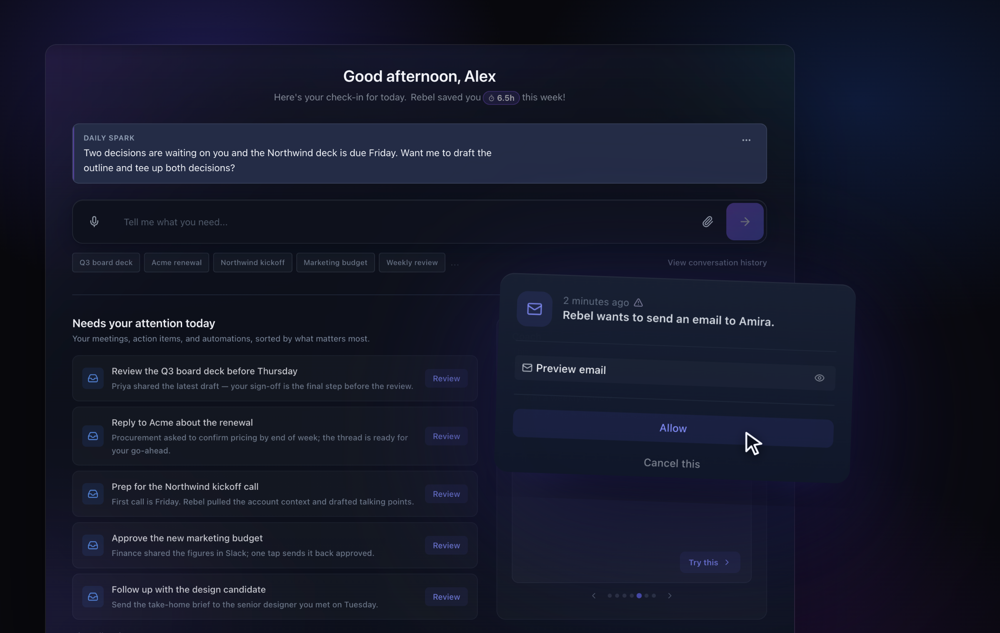
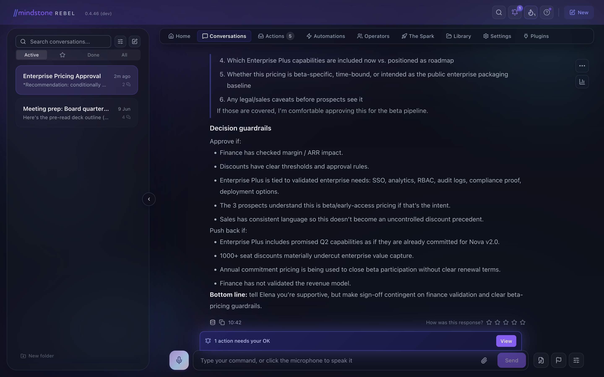
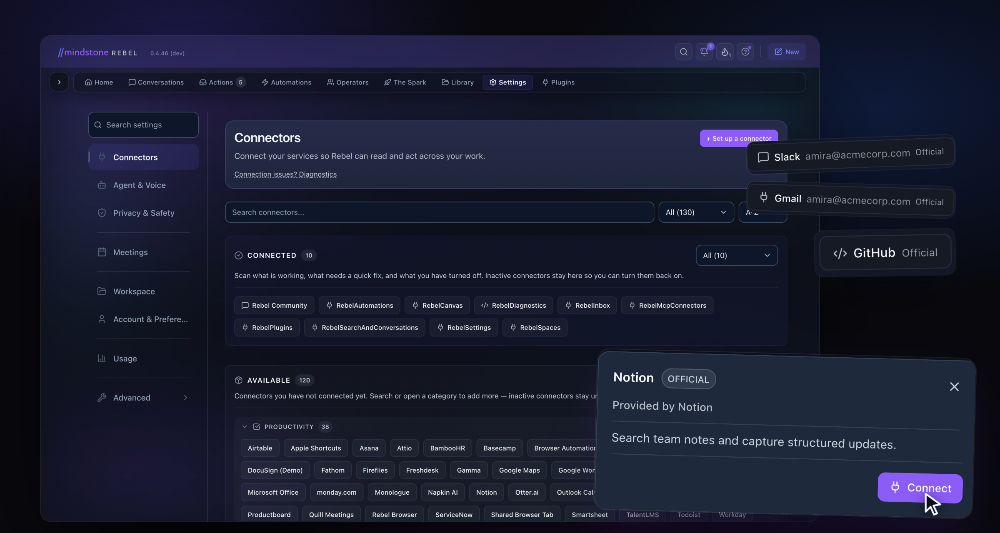

<p align="center">
  
</p>

<h1 align="center">Rebel is the AI workspace for agents that know your work — and ask before doing anything spicy.</h1>

<p align="center">
  A voice-first agentic-AI desktop app for the work that fills your day — meeting prep, email triage,
  research synthesis, drafting — powered by <strong>Rebel Core</strong>, a native in-process agent runtime
  that talks directly to multiple AI providers via API, including Anthropic, OpenAI, and OpenRouter,
  and to your tools over MCP.
</p>

<p align="center">
  <a href="#install"><strong>Install</strong></a> ·
  <a href="#connectors-and-oauth-mcp">Connect tools</a> ·
  <a href="#contributing">Contributing</a> ·
  <a href="AGENTS.md">Contributing with an agent?</a> ·
  <a href="#license">License</a>
</p>

<p align="center">
  
  
  
</p>

<p align="center">
  
</p>

---

> **Note for humans:** read this README.
> **Note for AI agents:** read [`AGENTS.md`](AGENTS.md) before touching files.

## Most people should download Rebel

If you want to use Rebel, start with the desktop app at
[rebel.mindstone.com](https://rebel.mindstone.com). It gives you the smoothest
experience: automatic updates, built-in authentication, product metrics that
help us improve Rebel, and the simplest setup path.

This source code is for developers who want to inspect, modify, or contribute to
Rebel.

## Your AI has enough chat windows. Give it a workspace.

Most AI tools are brilliant for five minutes and forgetful by tomorrow. Rebel is
different: it works from your actual workspace, connects to the tools you
already use, remembers the context that matters, and checks with you before it
changes the world.

Rebel OSS is **for individuals and small teams**. It is built for people, not
enterprise fleet deployment: no admin console, no org rollout machinery, no
account system. You bring your own keys, your tools connect over MCP, and the
app gets out of the way.

It speaks plainly. You can talk to it, hand it a thread of context, and let it
do the legwork — without needing to know what MCP stands for.


## What is Rebel?

Rebel is Mindstone's AI workspace for doing real work with agents: meetings,
messages, files, calendars, tickets, docs, follow-ups, automations, and the
tiny "can you just…" tasks that somehow eat Wednesday.

Rebel does **not** try to be the model. You choose the model. Rebel is the
environment around it: memory, tools, permissions, workflows, approvals, and
taste.

The useful bits:

- **Spaces** — keep personal, team, project, and shared context separated
  instead of pouring everything into one giant soup.
- **Skills** — reusable workflows written in Markdown, so humans and agents can
  both inspect and improve them.
- **Memory** — source captures, topic notes, and high-utility context stored in
  the right place.
- **MCP connectors** — connect agents to real tools such as email, calendar,
  docs, Slack, Linear, Notion, GitHub, Sentry, PostHog, and custom MCP servers.
- **Approvals** — sensitive actions can be staged for human review before they
  send, post, schedule, delete, or write shared memory.
- **Voice + text** — talk when typing is annoying; type when talking to your
  laptop in public would be socially ambitious.
- **Desktop-first, local-first** — your workspace and controls live on your
  machine. Want a cloud backend for mobile/browser continuity? Self-host it
  (see [BYOK](#bring-your-own-keys-byok)).


## Status

Experimental and in active development. APIs, workflows, and the occasional
good idea may change without notice. The production desktop app is the best way
to use Rebel; start at [rebel.mindstone.com](https://rebel.mindstone.com).
Build from source if you want to inspect, modify, or contribute (see
[Install](#install)).


## What makes Rebel different?

### Memory without the haunted attic

Rebel organises context into Spaces, source captures, topic memory, and skills.
The point is not "infinite memory". The point is **the right memory in the
right place**.

### Tools with brakes

Agents are useful because they can act. Agents are terrifying because they can
act. Rebel is designed around that tension.

Sensitive actions can be staged for approval first. Power, with a seatbelt.
Very radical. Apparently necessary.

<p align="center">
  
</p>

<p align="center">
  
</p>

### Skills that humans and agents can both read

A Rebel skill is a reusable workflow written in Markdown. It is inspectable,
editable, portable, and agent-friendly. A good skill is not magic — it is the
best way of doing something, written down clearly enough that an agent can run
it again.

### MCPs without the "good luck with JSON" ceremony

Rebel uses MCP connectors so agents can reach the tools you already work in.
Builders can add connectors; users can enable them from the app. The aim is
simple: useful agents without every person becoming a part-time infrastructure
engineer.

<p align="center">
  
</p>


## Install

There are no downloadable installers in this repository. If you want the
production build, start at [rebel.mindstone.com](https://rebel.mindstone.com).

If you want to work on Rebel itself, you build it from source on all three
platforms. It is less effort than it sounds.

**Prerequisites and the full walkthrough** (Node version, core directory, voice
and MCP configuration, the "it actually runs" checks) live in
[`docs/project/SETUP_DEVELOPMENT_ENVIRONMENT.md`](docs/project/SETUP_DEVELOPMENT_ENVIRONMENT.md).
The commands below are the short version.

```bash
# Clone with submodules
git clone --recurse-submodules https://github.com/mindstone/rebel-app.git
cd rebel-app

# One-time bootstrap: submodules, dependencies, and connector builds.
# (Also initialises submodules if you forgot --recurse-submodules above.)
npm run setup

# Run in development (dev server + HMR)
npm run dev

# Build a packaged app
npm run build
```

`npm run setup` does the whole fresh-clone bootstrap in one cross-platform step:
it checks your toolchain (Node 20+, npm, git), initialises the submodules,
installs dependencies, builds the connectors, and scaffolds a `.env.local`. It
asks for nothing — you add your AI key inside the app on first run (see below).

### Updating

For source builds, there is no auto-updater. You stay current the same way you
got here — with git:

```bash
git pull
git submodule update --init --recursive
npm ci
```

Re-run `npm ci` after pulling so dependency changes are picked up.

### Platforms

- **macOS** — supported
- **Windows** — supported
- **Linux** — beta

Builds are unsigned unless you supply your own certificates.


## Bring your own keys (BYOK)

Rebel ships with no credentials of its own. Everything you connect, you own.

- **LLM providers** — bring your own keys for Anthropic, OpenAI, Gemini, and
  OpenRouter. Add them in Settings.
- **Self-hosted cloud** — the managed Mindstone cloud is not part of the OSS
  build. If you want a cloud backend, self-host `cloud-service` on your own
  Fly infrastructure.
- **Meeting recorder** — BYOK as well: supply your own Recall API key and pay
  Recall as you go.

This is a pointer, not a manual. See
[`docs/project/SETUP_DEVELOPMENT_ENVIRONMENT.md`](docs/project/SETUP_DEVELOPMENT_ENVIRONMENT.md)
and [`.env.example`](.env.example) for the specifics.


## Connectors and OAuth (MCP)

Rebel's connectors — Slack, Microsoft, Salesforce, GitHub, and others — sign in
over OAuth via a hosted redirect worker at `rebel-auth.mindstone.com`, used by
default. It is a **pure redirect proxy**: no Mindstone account required, no
secrets held, no token exchange. The token exchange happens on your machine
using OAuth client credentials you register yourself per provider (see
[`.env.example`](.env.example)).

If you would rather host the redirect worker yourself, each connector's
`REDIRECT_URI` is overridable via environment variable.

On the hosted worker, our commitment:

> We intend to run `rebel-auth.mindstone.com` indefinitely as a free public
> service for the OSS community; best-effort, no SLA; at least 6 months' notice
> + migration guide if we ever sunset; existing redirect paths preserved
> backwards-compatibly.


## Telemetry and privacy

Rebel OSS ships with telemetry **off** and sends nothing by default. You can opt
in from Developer settings using your **own** Sentry / RudderStack credentials.
No telemetry goes to Mindstone. If you opt in, events go only to the Sentry / RudderStack projects you configure.


## Contributing

Contributions are welcome. Before you open a pull request:

- Read [`CONTRIBUTING.md`](CONTRIBUTING.md) — contributions use a
  **Developer Certificate of Origin** sign-off (`git commit -s`), no CLA.
- Read the [`CODE_OF_CONDUCT.md`](CODE_OF_CONDUCT.md).
- Report security issues privately per [`SECURITY.md`](SECURITY.md), not in
  public issues.

People will contribute to this repo with AI agents. We are not pretending
otherwise. If you are using Claude Code, Cursor, Codex, or another coding
agent, point it at [`AGENTS.md`](AGENTS.md) before it touches files. Agents are
fast. That is useful. They are also fast at being confidently wrong. That is
less useful.

<p align="center">
  
</p>


## The Mindstone open-source family

Rebel is one of several open-source projects from Mindstone:

- [`mcp-servers`](https://github.com/mindstone/mcp-servers) — source-available
  MCP connectors for popular SaaS tools; works with any MCP host.
- [`Super-MCP`](https://github.com/mindstone/Super-MCP) — a proxy MCP router
  that saves your context window by loading only the tools you actually need.
- [`rebel-system`](https://github.com/mindstone/rebel-system) — the public
  Rebel system: skills, prompts, operators, help docs, and templates.


## License

Rebel is released under the **Business Source License 1.1 (BSL-1.1)** — a Fair
Source license. The source is available, with a **100-Installed-Seat-per-
Organisation Additional Use Grant** during the source-available period. Each
version converts to the **MIT License** on its Change Date (the second
anniversary of that version's first public release), and the seat cap drops away
with it. Above the cap, contact `hello@mindstone.com` for a commercial license.

Full terms: [`LICENSE`](LICENSE).

**Trademark.** "Rebel" is a common-law trademark of Mindstone Learning Limited.
Forks and modified distributions must use a different name. See
[`TRADEMARK.md`](TRADEMARK.md).
