# Semantic Search Systems

This document covers both semantic search systems in Rebel:
1. **File Search** - Workspace file content via `@files` keyword
2. **Conversation Search** - Sidebar history search via vector embeddings

Both use the same embedding model (BGE-small-en-v1.5) and LanceDB for vector storage.

## See Also

- [SEARCH.md](SEARCH.md) - Overview of all search systems (fuzzy autocomplete, semantic, conversation)
- [LIBRARY_AND_FILE_ACCESS.md](LIBRARY_AND_FILE_ACCESS.md) - Workspace selection and file access context
- [LANCEDB_REFERENCE](../research/libraries/LANCEDB_REFERENCE.md) - Deep-dive on LanceDB vector database, API patterns, and Electron integration

---

# Conversation Semantic Search

Hybrid sidebar conversation search using LanceDB full-text search plus semantic embeddings.

## Architecture

- **Storage**: `~/Library/Application Support/mindstone-rebel/indices/global/conversations/lancedb/`
- **One embedding per conversation** (not chunked like files)
- **Embedding text** (for vectors): Title + first user message (500 chars) + recent user messages (3000 chars)
- **FTS text** (`search_text` field): All non-hidden user messages + first non-hidden assistant response (capped at 2K chars), 12K total budget. Queried via `MultiMatchQuery(['title', 'search_text'])`.
- **Re-embedding**: Conversations are re-embedded when they grow significantly

### What Gets Embedded

The embedding captures both "what the conversation is about" and "what we're currently discussing":

```
[Title]

[First user message - up to 500 chars]

[Recent user messages - up to 3000 chars total, newest first]
```

Total budget: ~4000 characters (`MAX_EMBEDDING_TEXT_CHARS = 4000`).

### Re-embedding Logic

Conversations are re-embedded when they've grown since initial indexing:

| Condition | Value | Description |
|-----------|-------|-------------|
| Message delta | 2+ new user messages | Minimum change to trigger re-embed |
| Idle time | 5 minutes | Session must be idle (no updates) |
| Check interval | 5 minutes | How often stale embeddings are checked |

**How it works:**
1. On each `sessions:save`, the sessions list is cached in memory
2. Every 5 minutes, `checkStaleEmbeddings()` scans the cached sessions
3. For each embedded session: compare current `userMessageCount` vs stored count
4. If delta >= 2 AND session idle for 5+ min → re-embed

**Efficiency:** The scan iterates all sessions but does O(1) lookups per session (Set/Map membership). Only stale sessions trigger the expensive embedding generation. For typical usage (100-500 conversations), the scan takes <1ms.

### Exclusions

Sessions are **never embedded** (or removed if already embedded):
- Privacy mode sessions
- Demo mode sessions
- Corrupted sessions
- Sessions with no user messages
- Soft-deleted sessions (in trash)

### Schema

```typescript
interface ConversationEmbeddingRecord {
  sessionId: string;       // Primary key
  title: string;
  search_text: string;     // All non-hidden user messages + first assistant response (FTS-only, not embedded)
  createdAt: number;
  updatedAt: number;
  origin: string;          // 'manual' | 'automation'
  messageCount: number;
  userMessageCount: number; // For re-embed detection
  embeddedAt: number;      // When embedding was generated
  embeddingModel: string;
  vector: number[];        // 384 dims
}
```

### Testing via DevTools

```javascript
// Check conversation index status
await window.searchApi.conversationIndexStatus()
// Returns: { totalEmbeddings, isInitialized, indexedSessionIds, ... }

// Semantic search for conversations
await window.searchApi.conversationsSemantic({ query: "budget planning", limit: 10 })

// Find similar conversations to a session
await window.searchApi.similarConversations({ sessionId: "abc-123", limit: 5 })
```

### Key Files

| File | Purpose |
|------|---------|
| `src/main/services/conversationIndexService.ts` | Embedding, re-embedding, search, stale detection |
| `src/renderer/features/agent-session/hooks/useSessionSearch.ts` | Combines Fuse.js + semantic results |
| `src/renderer/utils/conversationSearch.tsx` | IPC wrappers for semantic search |

### Forcing a Full Reindex (Model Version Bump)

The `CURRENT_EMBEDDING_MODEL` constant controls when a full reindex is triggered. On startup, if the stored model string doesn't match the current constant, the entire conversation index is cleared and rebuilt.

```typescript
// conversationIndexService.ts
export const CURRENT_EMBEDDING_MODEL = 'Xenova/bge-small-en-v1.5-v2';
```

**Why bump the version?** When the embedding *strategy* changes (what text gets embedded), old and new vectors aren't comparable. For example, in Jan 2025 we expanded from "title + first user message" to "title + first user message + recent user messages". Mixing old narrow embeddings with new expanded ones would give inconsistent search results.

**How to force reindex:** Append a version suffix (e.g., `-v2`, `-v3`) to the model string. The underlying model (`Xenova/bge-small-en-v1.5`) stays the same - only the version identifier changes. This triggers the reindex logic without actually changing the ML model.

---

# File Search System

Hybrid search for workspace files combining LanceDB native FTS, vector embeddings, and Reciprocal Rank Fusion (RRF). Users can search their workspace by including `@files` in their message.

## Architecture Overview



The diagram shows two parallel flows:
- **Indexing Flow (yellow)**: Background process that watches files, chunks them, generates embeddings, and stores in LanceDB
- **Search Flow (blue)**: Per-turn process triggered by keywords that searches vectors and injects context into the agent prompt

### Keyword-Triggered Search

File search is **explicitly triggered** by including `@files` in your message.

This design is intentional:
- **Transparent**: Users know exactly when file search runs (no hidden AI calls)
- **Fast**: No additional LLM calls for intent classification
- **Predictable**: Same keyword always produces the same behavior
- **Cost-effective**: No per-message Haiku calls for query refinement

## Search Keyword

Include `@files` in your message to search your workspace:

| Keyword | Effect |
|---------|--------|
| `@files` | Searches up to 15 files with lower threshold (0.30) |

### Keyword Detection Rules

The keyword is matched with boundary awareness to avoid false positives:

**Valid matches:**
- `@files find the config file` (start of message)
- `please @files for pricing` (mid-sentence with whitespace)
- `@files, what about the roadmap?` (with trailing punctuation)

**Not matched (false positive prevention):**
- `@files-extended` (part of longer term)
- `@filesearch` (partial match)

When the keyword is detected:
1. The keyword is stripped from the prompt sent to the agent
2. Hybrid search runs with expanded limits (15 files) and lower threshold (0.30)
3. Matching files are injected into the agent's context as markdown

## Components

### Database: LanceDB

- **What**: Embedded vector database written in Rust, runs in-process
- **Bundled**: Yes, via npm (`@lancedb/lancedb`) - no external server needed
- **Storage**: `~/Library/Application Support/mindstone-rebel/indices/{workspace-hash}/lancedb/`
- **Metadata**: `~/Library/Application Support/mindstone-rebel/indices/{workspace-hash}/index_metadata.json`
- **Why**: Fast cosine similarity search, handles millions of vectors, zero config

### Embedding Model: BGE-small-en-v1.5

- **What**: BGE (BAAI General Embedding) model optimized for retrieval tasks
- **Library**: `@huggingface/transformers` (transformers.js)
- **Dimensions**: 384-dimensional vectors
- **Size**: ~33MB, cached in `~/Library/Application Support/mindstone-rebel/models/transformers/`
- **Query prefix**: Search queries use `"Represent this sentence for searching relevant passages: "` prefix for better retrieval

### Embedding Backend Architecture

The embedding service uses a **dual-backend architecture** with GPU preferred and CPU fallback:

| Backend | Implementation | When Used |
|---------|---------------|-----------|
| **GPU** (preferred) | Hidden BrowserWindow with WebGPU | Default if WebGPU available |
| **CPU** (fallback) | Node.js utilityProcess with ONNX | If GPU unavailable or disabled |

**Backend selection** happens once at initialization:
1. If `gpuEmbeddingEnabled === false` in settings → CPU
2. Try GPU backend initialization
3. If GPU not available or fails → fall back to CPU permanently

**Key design**: GPU and CPU backends are mutually exclusive. We do **not** hot-swap between them during runtime to prevent race conditions.

### Priority Queue System

Both backends use a **dual-queue system** to prioritize user-facing operations:

| Queue | Use Case | Timeout |
|-------|----------|---------|
| **Priority** | User queries (semantic search) | 8 seconds |
| **Batch** | Background indexing | 15 seconds |

User queries always preempt background indexing work, ensuring responsive search even during heavy file indexing.

### Backend Implementations

**GPU Backend** (`gpuEmbeddingBackend.ts`, `gpu-worker/renderer.ts`):
- Runs in a hidden BrowserWindow with WebGPU access
- Faster for batch operations via GPU parallelism
- Includes leak-safe disposal when auto-disabled

**CPU Backend** (`embeddingWorker.ts`):
- Runs in a utilityProcess (isolated from main process)
- Uses ONNX Runtime for inference
- On Windows, limits threads to 4 (`OMP_NUM_THREADS`) to prevent CPU saturation

### File Watcher: Chokidar

- **What**: Cross-platform file watching library
- **Patterns**: Respects gitignore-like exclusion patterns (node_modules, .git, build outputs, etc.)
- **Depth**: Watches up to 10 levels deep, follows symlinks

## Data Flow

### Indexing Flow

1. **File Discovery**: Chokidar watches workspace, queues files for indexing
2. **Mtime Check**: Files checked against in-memory mtime cache (O(1) lookup, no DB query)
3. **Chunking**: Changed files split into ~2000 character chunks with 200 character overlap
4. **Embedding**: Chunks sent to Worker Thread for embedding (main thread stays responsive)
5. **Storage**: Chunks + vectors stored in LanceDB with file metadata (mtime, path)
6. **Cache Update**: In-memory mtime cache updated for instant future lookups

### Metadata Enrichment (FOX-2770)

Before embedding, each chunk is enriched with structural metadata to improve retrieval when queries match filenames, paths, or document titles rather than body content. This replaces the old "enhancement service" which used LLM calls (Haiku) for the same purpose.

**Current approach — mechanical prefix (shipped):**

```
Title: {frontmatter title}
Path: {relative/path/to/file.md}

{raw chunk content}
```

The title is extracted from YAML frontmatter (`title:` or `name:` fields, max 200 chars). The enriched text is used *only* for embedding generation — the raw chunk content is stored separately for display.

LanceDB's native FTS branch also searches `filename_stem` with a 2x boost vs `content` (1x), so keyword searches like "negotiation engine" strongly prefer files whose names match.

**Previous approach — LLM enhancement (removed):**

The enhancement service called Haiku per-chunk to generate a 1-2 sentence context prefix:

```
This section covers the Salesforce OAuth token expiration issue requiring reconnection.

{raw chunk content}
```

This was per-chunk and context-aware (different context for each chunk of the same file), but required API credentials, cost ~$0.01-0.05 per workspace, took minutes of background processing, was off by default, and occasionally added noise that hurt rankings.

**Trade-offs between the two approaches:**

| Dimension | Mechanical prefix | LLM enhancement |
|-----------|------------------|-----------------|
| **Cost** | Zero | ~$0.01-0.05 per workspace |
| **Latency** | Instant (at index time) | Minutes of background processing |
| **API dependency** | None | Requires valid auth + Haiku access |
| **Chunk awareness** | Same prefix for all chunks of a file | Unique context per chunk |
| **Best at** | File-level recall (finding the right file) | Chunk-level precision (finding the right chunk within a large file) |
| **Risk** | Adds tokens that dilute chunk signal for long files | LLM context can add noise that hurts rankings |

**Where this matters most in practice:**

Rebel workspaces are dominated by large multi-chunk files (91% of files are >2000 chars, average ~15 chunks per file). For a 25-chunk topic file, the mechanical prefix is identical on every chunk — it helps find the right *file* but doesn't help distinguish chunk 3 (about Slack) from chunk 12 (about Salesforce) within that file.

The old enhancement service could write different context per chunk, giving it an edge on chunk-level precision within large files. However, it was off by default for most users, making the mechanical approach a strict improvement over the baseline (no enrichment at all).

**Benchmark results (99-doc synthetic corpus, 36 queries):**

| Slice | Legacy | Enhanced | Metadata | L→M | E→M |
|-------|--------|----------|----------|-----|-----|
| ALL | 0.969 | 0.967 | **0.971** | +0.002 | +0.004 |
| filename (7q) | 0.996 | 1.000 | 0.990 | -0.006 | -0.010 |
| frontmatter_title (11q) | 0.997 | 1.000 | 0.994 | -0.003 | -0.006 |
| content_control (3q) | 0.877 | 0.877 | 0.877 | 0.000 | 0.000 |
| disambiguation (15q) | 0.954 | 0.946 | **0.964** | +0.010 | +0.019 |

Metadata beats both legacy and enhancement on disambiguation queries (the hardest category). Content-only queries are unaffected. Small regressions on filename/title queries are from minor secondary-result reordering, not primary-match failures. Hit@1 is 97% across all three variants.

Benchmark script: `evals/benchmarks/semantic-search.ts` (run with `npx tsx evals/benchmarks/semantic-search.ts --corpus large`).

**Upgrade path for existing users:**

On first launch after update, `checkSchemaCompatibility()` detects the legacy `is_enhanced`/`enhanced_at` columns, drops the table, resets `scanCompletedAt` to null, and the file watcher triggers a full rescan. Reindexing happens silently in the background — search returns fewer results temporarily until it completes.

**Future consideration:**

A hybrid approach could layer LLM enhancement on top of mechanical metadata — immediate metadata prefix at index time for baseline quality, with optional background enhancement as a second pass for users with API access. This would combine the strengths of both approaches. Not currently planned.

### Startup Behavior

On app launch, the indexing system:

1. **Loads mtime cache**: Single DB query loads all `path → mtime` pairs into memory (~1-2 seconds for 1000 files)
2. **Checks scan completion**: Reads `index_metadata.json` to see if previous scan completed
3. **Skip or rescan decision**:
   - If scan completed within 1 hour → Skip full rescan, only watch for new changes
   - If scan never completed or >1 hour old → Full rescan (but unchanged files skip instantly via mtime cache)
4. **Marks completion**: When queue empties, saves `scanCompletedAt` timestamp to metadata file

### Search Flow (keyword-triggered)

1. User sends message containing `@files`
2. **Keyword Detection**: `parseSearchKeywords()` detects keyword and strips it from prompt
3. User's message (minus keyword) embedded using BGE-small-en-v1.5
4. **Hybrid search** runs in parallel:
   - **Vector search**: LanceDB cosine similarity on embeddings
   - **FTS search**: LanceDB native full-text search on `content` and `filename_stem`
5. LanceDB reranks the hybrid results with **Reciprocal Rank Fusion (RRF)** for best of both approaches
6. Files above 0.30 similarity threshold (up to 15) formatted as markdown
7. Injected before user's prompt:
   ```markdown
   ## Relevant Workspace Files
   
   The following files from your workspace may be relevant:
   
   ### customers/Acme-Corp-pack.md (relevance: 72%)
   ```

**Note**: If `@files` is not present, no file search runs. Users explicitly control when search happens.

**Path normalization note:** File search normalizes incoming file paths and path-prefix filters with `toPortablePath()` before querying, so LanceDB's forward-slash `relativePath` values match consistently across macOS, Windows, and Linux.

## File Structure

| File | Purpose |
|------|---------|
| `src/main/services/embeddingService.ts` | Backend orchestration, request routing, priority queues |
| `src/main/services/gpuEmbeddingBackend.ts` | GPU backend lifecycle, WebGPU availability checks |
| `src/main/gpu-worker/renderer.ts` | GPU worker running in hidden BrowserWindow |
| `src/main/workers/embeddingWorker.ts` | CPU backend worker (ONNX in utilityProcess) |
| `src/shared/ipc/gpuEmbeddingContract.ts` | IPC contract for GPU worker communication |
| `src/main/services/fileIndexService/index.ts` | LanceDB CRUD, chunking, search, mtime cache |
| `src/main/services/fileWatcherService.ts` | Chokidar file watching, async queue processing |
| `src/main/services/semanticContextService.ts` | Keyword parsing, search orchestration, formats results |
| `src/main/ipc/searchHandlers.ts` | IPC handlers for renderer communication |
| `src/renderer/features/library/providers/LibraryNavigatorProvider.tsx` | Index status display and controls in workspace drawer |
| `scripts/build-worker.mjs` | Builds worker separately from main vite build |

## Configuration Constants

### Chunking (fileIndexService.ts)

| Setting | Value | Description |
|---------|-------|-------------|
| `MAX_CHUNK_SIZE` | 2000 chars | Maximum characters per chunk |
| `CHUNK_OVERLAP` | 200 chars | Overlap between consecutive chunks |
| `MAX_FILE_SIZE` | 1MB | Files larger than this are skipped |

### Search (semanticContextService.ts)

| Setting | Value | Description |
|---------|-------|-------------|
| `MAX_EXPLICIT_SEARCH_FILES` | 15 | Maximum files for keyword-triggered searches |
| `HIGH_CONFIDENCE_FILE_THRESHOLD` | 0.65 | Files above this get multi-chunk excerpts (was 0.80, lowered based on spike data — see planning doc) |
| `MAX_SNIPPET_LENGTH` | 800 chars | Truncate normal-confidence snippets (below 0.65 score) |
| `MAX_SNIPPET_LENGTH_HIGH_CONFIDENCE` | 3000 chars | Single high-confidence chunk budget |
| `MAX_SNIPPET_LENGTH_MULTI_CHUNK` | 5000 chars | Budget for multi-chunk files (up to 3 non-overlapping chunks joined with `[...]`) |
| `MAX_TOTAL_FILE_CONTEXT_CHARS` | 15000 chars | Hard global cap on all file context combined |
| `MAX_CHUNKS_PER_HIGH_CONFIDENCE_FILE` | 3 | Max non-overlapping chunks per high-confidence file |

### Relevance Thresholds (RELEVANCE_THRESHOLDS)

| Threshold | Value | When Used |
|-----------|-------|-----------|
| `default` | 0.60 | Most queries - conservative since auto-executed |
| `explicitSearch` | 0.30 | `@files` keyword-triggered searches - cast wider net |
| `actionIntent` | 0.35 | Auto-detected action queries (e.g., "update the config") |
| `continuation` | 0.65 | Follow-up turns — stricter than new conversations. Matches HIGH_CONFIDENCE_FILE_THRESHOLD |

> **Removed thresholds:** `shortQuery` (0.25) and `failSafe` (0.60) were removed as dead code. `failSafe` was deliberately unwired when Haiku intent classification was removed (Dec 2025); `shortQuery` was accidentally orphaned during worker migration (Jan 2026). Investigation showed short queries don't need a separate threshold — smart query generation already rewrites prompts before embedding. See `docs-private/investigations/260330_shortQuery_failSafe_threshold_dead_code.md`.

**Conversation thresholds** (in `conversationContextService.ts`):

| Threshold | Value | Description |
|-----------|-------|-------------|
| `AUTO_CONVERSATION_THRESHOLD` | 0.55 | Min score for auto-injecting conversations |
| `HIGH_CONFIDENCE_CONVERSATION_THRESHOLD` | 0.60 | High-confidence conversations get larger excerpt budget (5000 vs 3500 chars) |

> **Threshold calibration:** These values were calibrated against real workspace data using `scripts/threshold-analysis.ts`. BGE-small-en cosine similarity scores cluster in ~0.40-0.70, with max ~0.79. Re-run the script periodically as workspace content evolves. See `docs/plans/260330_semantic_search_multi_chunk_highlighting.md` for full spike data.

### Multi-Chunk File Excerpts

For files scoring above `HIGH_CONFIDENCE_FILE_THRESHOLD` (0.65), the pre-turn worker returns up to 3 non-overlapping chunks instead of 1. Chunks are joined with `\n\n[...]\n\n` separators so the agent knows excerpts are non-contiguous. Overlap detection uses edge-based substring checks (first/last 200 chars) plus chunkIndex adjacency.

**Scope:** Pre-turn context assembly only (worker path). The `semanticSearch()` API and UI search still return one chunk per file. The main-process fallback receives pre-deduped single-chunk results from `fileIndexService.semanticSearch()`, so multi-chunk is effectively worker-only. See `docs/plans/260330_semantic_search_multi_chunk_highlighting.md` for design rationale.

### Recency Weighting (fileIndexService.ts)

Recently modified files receive a slight ranking boost to act as "working memory" — files you just edited are more likely to be relevant to your current task.

| Setting | Value | Description |
|---------|-------|-------------|
| `RECENCY_BOOST` | 0.15 | Max +15% boost for just-modified files |
| `RECENCY_HALF_LIFE_MS` | 7 days | Boost decays to half after 7 days |

**How it works:**
- Uses exponential decay: `boost = 1 + 0.15 * 2^(-age/halfLife)`
- A file modified just now gets +15% to its fused ranking score
- A file modified 7 days ago gets +7.5% boost (half-life)
- A file modified 14 days ago gets +3.75% boost
- Very old files effectively get no boost (~1.0x multiplier)

**Important:** Recency only affects ranking among already-relevant files. The relevance threshold is based on raw vector similarity (independent of recency), so irrelevant files can't be promoted just because they're recent.

### Queue Processing (fileWatcherService.ts)

| Setting | Value | Description |
|---------|-------|-------------|
| `INTER_FILE_DELAY_MS` | 20ms | Yield to event loop between files |
| `GC_INTERVAL` | 50 | Longer pause every N files for garbage collection |
| `GC_PAUSE_MS` | 100ms | Duration of GC pause |
| `MAX_QUEUE_SIZE` | 500,000 | Backpressure limit - new items rejected if exceeded |
| `SKIP_RESCAN_THRESHOLD_MS` | 1 hour | Skip full rescan if previous scan completed within this time |

**Note:** The queue processes files **sequentially** (one at a time), not in parallel. This is intentional - the Worker Thread doing embeddings is the bottleneck, and sequential processing avoids same-file race conditions. See the design comments in `fileWatcherService.ts` for details.

### Model Loading (embeddingService.ts)

| Setting | Value | Description |
|---------|-------|-------------|
| `MODEL_LOAD_DELAY_MS` | 1000ms | Delay before loading model in worker |
| `REQUEST_TIMEOUT_MS` | 30000ms | Timeout per embedding request |
| `INIT_TIMEOUT_MS` | 60000ms | Timeout for worker initialization |

## Indexed File Types

```
.ts, .tsx, .js, .jsx, .mjs, .cjs, .json, .md, .mdx, .txt, .freex,
.yaml, .yml, .css, .scss, .less, .html, .xml, .py, .rb,
.go, .rs, .java, .kt, .swift, .c, .cpp, .h, .hpp, .cs,
.php, .sql, .sh, .bash, .zsh, .toml, .gitignore, .eslintrc, .prettierrc
```

Also indexes special files: `Dockerfile`, `Makefile`, `README`, `LICENSE`, etc.

## Security: Excluded Files

The following files are **never indexed** to prevent secrets from being sent to the LLM:

| Pattern | Reason |
|---------|--------|
| `.env`, `.env.*` | Environment variables with secrets |
| `*.pem`, `*.key`, `*.crt` | SSL/TLS certificates and keys |
| `*.p12`, `*.pfx` | Certificate bundles |
| `id_rsa*`, `id_ed25519*` | SSH keys |
| `*.secret`, `*.secrets` | Explicit secret files |
| `credentials*` | Credential files |
| `secrets/`, `.secrets/` | Secret directories |

These patterns are enforced at two levels:
1. **Chokidar ignore patterns** - files are never even discovered
2. **shouldIndexFile() check** - secondary filter before indexing

## UI: Index Status Display

Located in the workspace drawer (via `WorkspaceNavigatorProvider`), shows:
- **While indexing**: Percentage progress (e.g., "42%")
- **When complete**: "1,200 files" indexed count
- Polls status every 2 seconds when drawer is open via `window.searchApi.indexStatus()`

## IPC Contracts

| Channel | Purpose |
|---------|---------|
| `search:semantic` | Run semantic search |
| `search:index-status` | Get indexing status |
| `search:start-watching` | Start file watcher |
| `search:stop-watching` | Stop file watcher |
| `search:reindex` | Trigger full reindex |
| `search:clear-index` | Clear index |

## Testing via DevTools

Open DevTools (`Cmd+Option+I` / `Ctrl+Shift+I`) and use these commands in the Console:

### Index Status & Management

```javascript
// Check current index status
await window.searchApi.indexStatus()
// Returns: { totalFiles, indexedFiles, pendingFiles, isWatching, workspacePath, lastIndexedAt }

// Start file watcher (begins indexing)
await window.searchApi.startWatching()

// Stop file watcher
await window.searchApi.stopWatching()

// Trigger full reindex of workspace
await window.searchApi.reindex()

// Clear the entire index (use with caution)
await window.searchApi.clearIndex()
```

### File Search (Hybrid)

```javascript
// Basic search (uses hybrid vector + LanceDB native FTS search)
await window.searchApi.semantic({ query: "authentication flow" })
// Returns: [{ path, relativePath, snippet, score, extension, chunkIndex }, ...]

// Search with custom options
await window.searchApi.semantic({ 
  query: "Q4 report", 
  limit: 10,           // Max results (default: 10)
  threshold: 0.3       // Min similarity score 0-1 (default: 0.30)
})

// Low threshold to see more results (useful for debugging)
await window.searchApi.semantic({ query: "pricing", limit: 20, threshold: 0.1 })
```

### Understanding Results

```javascript
// Search and format results nicely
const results = await window.searchApi.semantic({ query: "config", limit: 5 });
results.forEach((r, i) => {
  console.log(`${i+1}. ${r.relativePath} (${(r.score * 100).toFixed(0)}%)`);
  console.log(`   ${r.snippet.slice(0, 100)}...`);
});
```

### Threshold Reference

| Threshold | Use Case |
|-----------|----------|
| 0.65 | Continuation turns - stricter |
| 0.60 | Default - good precision |
| 0.35 | Action intent queries - automatic context |
| 0.30 | Explicit `@files` searches - wider net |
| 0.1-0.2 | Debugging - see what's being indexed |

## Index health and degradation

Consolidated implementation reference: [SEARCH_INDEX_DEGRADATION.md](SEARCH_INDEX_DEGRADATION.md).

### Unavailable vs empty (file + conversation search)

User-facing paths that need honest empty-state copy must use status-aware APIs, not best-effort `[]` wrappers:

- **Files:** `semanticSearchWithStatus()` in `src/main/services/fileIndexService/search.ts` returns `FileSearchStatus` (`ok` | `index_not_ready` | `embedding_unavailable` | `error`). `semanticSearch()` still unwraps to `results` only — legacy/internal callers.
- **Conversations:** `searchConversationsWithStatus()` in `conversationIndexService.ts` mirrors the same contract for sidebar and MCP bridges.

`index_not_ready` / `embedding_unavailable` / `error` → "warming up" or "temporarily unavailable" copy. `ok` + empty → genuine no-match. See [SEARCH.md § Unavailable vs no results](SEARCH.md#unavailable-vs-no-results) for the cross-surface UX contract and agent-tool signposts (`rebel_search_files`, `rebel_search_sources`).

### FTS index degradation (observability + health copy)

Hybrid file search prefers LanceDB native FTS + vector + RRF. When FTS indexes are missing or fail, search **degrades to vector-only** and still returns `status: 'ok'` — keyword ranking is weaker, not absent.

**Sentry (known conditions, once per process/workspace phase):**

| Condition | When | Signpost |
|-----------|------|----------|
| `file_index_fts_degraded` | FTS build/verify failed (`ensureFTSIndexes` in `fileIndexService/index.ts`) or per-query hybrid/rerank fallback (`search.ts`, `phase: 'runtime'`) | `src/core/sentry/knownConditions.ts` |
| `file_index_semantic_search_failed` | Unexpected failure after index + embedding were available (would otherwise look like no results) | `search.ts` via `semanticSearchWithStatus()` |

**Diagnostics health check** (`src/main/services/health/checks/semanticSearch.ts`, desktop-only):

- **Index not open** (`!hasIndex()`): `warn` with honest copy — files remain findable by name (Quick Open) and readable by the assistant; meaning-based ranking returns when the index finishes opening. Does not imply the user must manually enable indexing.
- **FTS build failed** (`getFtsStatus() === 'failed'`): quiet `warn` — "Keyword search ranking is temporarily reduced — search still works". Not a global `fail` (no false "data loss" alarm); vector + name search unaffected; rebuilds automatically on Library updates.

## ENFILE Resilience

When the system hits file descriptor limits (ENFILE/EMFILE errors), LanceDB operations can spiral into CPU storms from rapid retries. The indexing services now detect these errors and enter a cooldown period:

- All LanceDB operations (open, add, search) are paused during cooldown
- A toast notification alerts the user
- Operations resume automatically after the cooldown expires
- See `fileIndexService.ts`, `conversationIndexService.ts`, and `toolIndexService.ts` for implementation

## Performance Considerations

1. **Isolated Embedding Backends**: GPU runs in hidden BrowserWindow, CPU in utilityProcess - main process stays responsive
2. **Priority Queues**: User queries preempt background indexing for responsive search during heavy loads
3. **Hybrid Search**: LanceDB native FTS and vector search run together, then RRF reranks the combined results
4. **Mtime Cache**: In-memory `Map<path, mtime>` enables O(1) change detection (no DB queries)
5. **Skip Rescan**: If scan completed within 1 hour, skip full file discovery on restart
6. **Sequential Processing**: Files processed one at a time (embedding backend is the bottleneck, not the queue)
7. **Incremental**: Only re-indexes files when mtime changes
8. **Backpressure**: Queue capped at 500,000 items to prevent memory exhaustion

## Dependencies

```json
{
  "@lancedb/lancedb": "^0.22.3",
  "@huggingface/transformers": "^3.8.1",
  "chokidar": "^5.0.0",
  "apache-arrow": "^18.1.0"
}
```

## RAG Best Practices Reference

Research into RAG context injection best practices (Dec 2024):

### Key Findings

1. **Content, not references**: RAG requires actual text content - file paths alone provide no knowledge for the model to reason about.

2. **Current system is conservative**: Industry recommendations suggest 10-20 chunks with 400-800 tokens each. Our 5 files × 800-2000 chars each (tiered: 800 normal, up to ~2000 for high-confidence) is modest.

3. **Context window math**: With Claude's 200K context, our ~4,000-10,000 chars/turn (depending on confidence tiers) is well within budget. Anthropic notes: "If your knowledge base < 200K tokens, just include it all."

4. **More chunks often better**: Anthropic found "passing top-20 chunks is more effective than top-10 or top-5."

### Anthropic's Contextual Retrieval

Anthropic recommends prepending 50-100 token context explanations to each chunk, describing what document it came from. This reduces retrieval failures by 49-67%.

**Reference**: [Introducing Contextual Retrieval](https://www.anthropic.com/news/contextual-retrieval) (Sep 2024)

### Potential Improvements

- Consider increasing `MAX_SNIPPET_LENGTH` for longer context per chunk
- ~~Add document-level context prefix to chunks (per Anthropic's approach)~~ → ✅ **DONE** in FOX-2770 (mechanical title+path prefix). See [Metadata Enrichment](#metadata-enrichment-fox-2770) for details and trade-offs vs LLM-based enhancement.

## LanceDB Version Management

LanceDB creates a new version file on every write operation (add/delete/update). Without periodic cleanup, this leads to massive storage bloat and slow queries.

### The Problem

LanceDB stores transaction history in `_transactions/` and `_versions/` directories. A healthy index might have dozens of version files; a bloated one can have 10,000+ files consuming gigabytes of storage for a dataset that should be kilobytes.

**Symptoms of version bloat:**
- Slow semantic search queries (seconds instead of milliseconds)
- Large index directories (GB instead of MB)
- Thousands of `.txn` files in `_transactions/`

### The Solution: Deferred optimize()

Both `fileIndexService.ts` and `conversationIndexService.ts` call `table.optimize()` to clean up old versions, but optimize is **decoupled from the write path** and deferred to an idle scheduler to avoid blocking writes (previously caused an 11-second startup hang):

```typescript
await table.optimize({
  cleanupOlderThan: new Date(Date.now() - OPTIMIZE_RETENTION_MS) // Keep 1 hour of history
});
```

**Triggering conditions:**
- **File index**: Every 500 writes OR every 30 minutes (whichever comes first), deferred to idle
- **Conversation index**: Every 500 writes OR every 30 minutes (with any pending writes), deferred to idle
- **Startup**: Deferred to idle scheduler rather than running synchronously

**Note:** `toolIndexService.ts` now uses incremental per-package refresh (add/delete) instead of drop/recreate, and schedules `optimize()` with the same thresholds as the file index (every 500 writes or 30 min). Change detection uses per-package SHA-256 hashes; only added/modified packages are re-embedded. A `refreshSerializer` serializes concurrent refresh requests. See [TOOL_AWARENESS § Architecture](TOOL_AWARENESS.md#architecture) and the [tool index incremental refresh planning doc](../plans/260402_tool_index_incremental_refresh.md).

### Manual Cleanup

If an index becomes bloated, the simplest fix is to clear and rebuild it:

```javascript
// In DevTools console - for file index:
await window.searchApi.clearIndex()
// Then restart the app or trigger reindex

// For conversation index:
await window.searchApi.clearConversationIndex()
// Then restart - backfill will rebuild the index
```

### Configuration Constants

| Setting | File Index | Conversation Index | Tool Index | Description |
|---------|------------|-------------------|------------|-------------|
| `OPTIMIZE_INTERVAL_MS` | 30 min | 30 min | 30 min | Minimum time between optimizations |
| `OPTIMIZE_RETENTION_MS` | 1 hour | 1 hour | 1 hour | Keep this much version history |
| `OPTIMIZE_AFTER_WRITES` | 500 | 500 | 500 | Trigger optimization after N writes |

## Threshold Analysis Script

`scripts/threshold-analysis.ts` runs score distribution analysis against real LanceDB indices:

```bash
# Default (resolves workspace from app-settings.json coreDirectory)
npx tsx scripts/threshold-analysis.ts

# Custom workspace
npx tsx scripts/threshold-analysis.ts --workspace-path "/path/to/workspace"

# Custom queries (JSON array of strings)
npx tsx scripts/threshold-analysis.ts --queries "/path/to/queries.json"
```

Outputs:
- Human-readable report to stdout
- Machine-readable JSON to `tmp/threshold-analysis-results.json` (gitignored)

Analyzes per-index score distributions, percentiles, histograms, multi-chunk distinctness, and conversation recency boost impact. Run periodically as workspace content evolves to validate threshold calibration.

See `docs/plans/260330_semantic_search_multi_chunk_highlighting.md` for the initial spike findings that informed current thresholds.

## LanceDB Predicate Safety

LanceDB uses Apache DataFusion for SQL parsing. DataFusion treats double-quoted camelCase identifiers (e.g., `"sessionId"`) as **string literals**, not column references — causing predicates to silently match nothing. See [postmortem](../../docs-private/postmortems/260402_lancedb_double_quote_quoting_postmortem.md).

**Rules:**

1. **Use the shared predicate utility** (`src/main/utils/lancedbPredicates.ts`) for all `.where()`, `.delete()`, and `update({ where: })` predicates. Never hand-roll SQL predicates in service files.
2. **New LanceDB columns MUST use snake_case** (e.g., `search_text`, `is_enhanced`, `filename_stem`). snake_case columns work without any identifier quoting in DataFusion. Existing camelCase columns (`sessionId`, `serverId`, `toolId`, `relativePath`) are safe via backtick quoting in the shared utility, but new columns should not rely on this.
3. **CI enforced**: `scripts/check-lancedb-predicates.ts` (wired into `validate:fast`) scans for double-quoted camelCase identifiers near predicate call sites and for local escape helper drift.

**Available helpers**: `eq(column, value)`, `and(...)`, `or(...)`, `likePrefix(column, prefix)`, `escapeValue(value)`.

## Performance Improvement Ideas

- ~~**Move embedding to a worker process**~~: ✅ **DONE** - GPU backend runs in hidden BrowserWindow, CPU in utilityProcess
- **Lightweight index hydration**: Current hydration reads every row on startup. Replace with cheap aggregates (row count, distinct paths) or a tiny metadata table to avoid pulling all chunk data/vectors into memory.
- ~~**Offload chunk embedding**~~: ✅ **DONE** - Embeddings run in isolated workers with priority queue; main process stays responsive
- **Gate auto-indexing**: Today we auto-start full watching/indexing when a `coreDirectory` exists. Require explicit user opt-in, pause when on battery/heavy load, or skip for very large workspaces.
- **Tighten symlink handling**: `followSymlinks: true` can pull in large linked trees and flood the queue. Disable by default or require an allowlist for followed paths.
