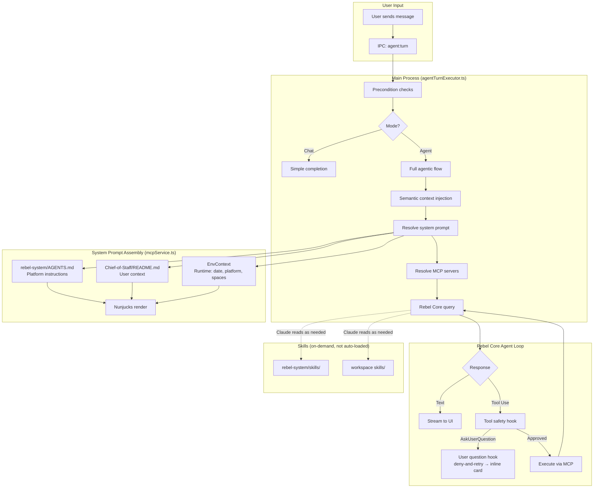

# System Prompt Architecture

### Introduction

This document explains how Mindstone Rebel constructs the system prompt for agent turns. The app uses a **composite approach** that combines platform-level instructions, user-level instructions, and dynamic runtime context into a single prompt.

### See also

- `docs/project/ARCHITECTURE_OVERVIEW.md` — High‑level architecture, including where agent turns are orchestrated and options passed to Rebel Core.
- `docs/project/SETTINGS_CONFIGURATION_AND_ENVIRONMENT.md` — App settings reference and environment variables.
- `docs/project/PROMPT_CACHING.md` — How prompt caching works; the system prompt structure affects cache efficiency.
- `docs/project/TOOL_AWARENESS.md` — **How tool awareness context is injected** (frequent tools + connected packages + semantic tool search).
- `rebel-system/help-for-humans/spaces.md` — Conceptual guide to Spaces and `AGENTS.md` usage across spaces.
- `docs/project/MCP_ARCHITECTURE.md` — MCP configuration; referenced by the dynamic context included in the system prompt.
- `docs/project/SKILLS_DISCOVERY.md` — How skills are discovered from workspace and spaces (skills are not auto-loaded but available for agent to read).
- `docs/research/libraries/CLAUDE_AGENT_SDK_REFERENCE.md` — Archived SDK reference (historical — SDK removed April 2026).
- `docs/plans/finished/251129c_composite_system_prompt_with_nunjucks.md` — Planning document with implementation details and design decisions.

### Canonical documentation quick reference

| Topic | Doc | Code Entry Point |
|-------|-----|------------------|
| System prompt construction | This document | `src/main/services/mcpService.ts` → `resolveSystemPrompt()` |
| Turn lifecycle | [ARCHITECTURE_AGENT_TURN_EXECUTION.md](ARCHITECTURE_AGENT_TURN_EXECUTION.md) | `src/main/services/agentTurnExecutor.ts` |
| Skills discovery | [SKILLS_DISCOVERY.md](SKILLS_DISCOVERY.md) | `src/main/services/skillsService.ts` |
| Tool awareness | [TOOL_AWARENESS.md](TOOL_AWARENESS.md) | `src/main/services/toolUsageStore.ts`, `src/main/services/toolIndexService.ts` |
| Tool safety | [TOOL_SAFETY.md](TOOL_SAFETY.md) | `src/main/services/toolSafetyService.ts` |
| MCP architecture | [MCP_ARCHITECTURE.md](MCP_ARCHITECTURE.md) | `src/main/services/superMcpHttpManager.ts` |

### End-to-end flow diagram



### Principles and key decisions

The system prompt is **always** a composite of three parts:

1. **Platform-level instructions** (`rebel-system/AGENTS.md`) — Read-only, generic, Mindstone-maintained
2. **User-level instructions** (`Chief-of-Staff/README.md`) — Writable, user's router/cross-space context (legacy: `AGENTS.md` with fallback)
3. **Dynamic environment block** (`<dynamic_env>`) — Runtime context (date, platform, capabilities)

In addition to the composite prompt, **tool awareness context** is injected at runtime:

4. **Frequent Tools** — Personalized tool shortcuts grouped by package, with account identity (in system prompt)
5. **Connected Packages** — List of available MCP packages with descriptions (in system prompt)
6. **Suggested Tools** — Semantic search results based on the user's query (prepended to user message, NOT system prompt)

See `docs/project/TOOL_AWARENESS.md` for full details on how tool awareness works.

Key design decisions:
- There is no preset fallback; the composite approach is required and the only way things work.
- User-level instructions always come from `Chief-of-Staff/README.md` (with legacy `AGENTS.md` fallback). There is no settings-based override.
- Platform instructions are always included; users cannot disable them.
- The env block uses time buckets (not exact timestamps) for cache-friendly prompt chunks. See `PROMPT_CACHING.md` for details.
- Nunjucks templates with strict mode (`throwOnUndefined: true`) ensure all variables are defined.
- Tool awareness context is populated from `toolUsageStore.ts` and Super-MCP package metadata.

## Composite prompt structure

The rendered system prompt is a single markdown document. The `rebel-system/AGENTS.md` Nunjucks template embeds the Chief-of-Staff content and env context inline (there are no XML wrapper tags like `<Rebel-system-instructions>` in the output). The key dynamic blocks are:

```
<dynamic_env>
date: 2026-02-08 (Sunday)
time_of_day_bucket: evening
timezone: Europe/London (+00:00)
locale: en-GB (env: en_GB.UTF-8)

platform: darwin 24.6.0 (arm64)
app: version=0.3.16, channel=dev
model: claude-opus-4-7

workspace_path: /Users/you/Dropbox/dev/experim/Rebel-chief-of-staff
mcp_config_path: /Users/you/Library/Application Support/mindstone-rebel/mcp/super-mcp-router.json
</dynamic_env>

<spaces_available>
  - name: "Chief-of-Staff"
    path: "Chief-of-Staff/"
    description: "Router and cross-space context"
    type: "chief-of-staff"
    sharing: "private"
  ...
</spaces_available>

<frequent_mcp_tools>
  (personalized frequent tool shortcuts grouped by package)
</frequent_mcp_tools>

<connected_packages>
  (list of all connected MCP packages with descriptions)
</connected_packages>

<chief_of_staff_readme>
  {contents of Chief-of-Staff/README.md}
</chief_of_staff_readme>
```

Conditional fields (`session_type`, `privacy_mode`, `voice_active`) only appear when set to non-default values. See the Nunjucks template in `rebel-system/AGENTS.md` for the authoritative structure.

## Resolution flow

At the start of an agent turn, `resolveSystemPrompt()` computes the composite prompt:

### 1. Read platform instructions

- Path: `${coreDirectory}/rebel-system/AGENTS.md`
- Required; throws if missing (rebel-system must be initialized)
- EXTERNAL-IDE-FALLBACK blocks are stripped when running in the Rebel app

### 2. Read user instructions

- Path: `${coreDirectory}/Chief-of-Staff/README.md` (or legacy `AGENTS.md`)
- If missing, uses a minimal fallback: `# Chief of Staff\n\n(Chief-of-Staff space not yet configured)`

### 3. Generate environment context

Call `generateEnvContext(settings, options)` which returns an `EnvContext` object with fields rendered into the `<dynamic_env>` block and other template sections:

| Field | Purpose |
|-------|---------|
| `date` | Human-time reasoning (e.g., "2026-02-08 (Sunday)") |
| `timeOfDayBucket` | Approximate time bucket: late_night, morning, afternoon, evening, night |
| `timezone` | Timezone with UTC offset for scheduling/interpretation |
| `locale` | System locale for formatting guidance |
| `platform` | OS, version, architecture for platform-specific behavior |
| `appVersion` | Current app version (rendered as `app: version=X, channel=Y`) |
| `buildChannel` | dev, beta, or stable (combined with appVersion) |
| `workspacePath` | Absolute path to workspace for file references |
| `mcpConfigPath` | Path to MCP config file |
| `model` | Currently configured model |
| `sessionType` | Session mode (only rendered when not `interactive`) |
| `privacyMode` | Only rendered when enabled |
| `voiceActive` | Only rendered when enabled |
| `spaces` | Array of discovered spaces (rendered in `<spaces_available>`) |
| `isSafeMode` | Whether app is running in Safe Mode (conditional block) |
| `safeModeReason` | Reason for Safe Mode activation |
| `safeModeErrorCategory` | Error category that triggered Safe Mode |
| `safeModeSentryEventId` | Sentry event ID for the triggering error |
| `windowsPythonBlocked` | Whether Windows Store Python aliases are blocking commands |

### 4. Render composite

- Build `CompositePromptContext` with `{ rebelSystemMd, chiefOfStaffMd, runningInRebelApp: true, env }`
- Render using `rebel-system/AGENTS.md` as the Nunjucks template (it contains `{{ chiefOfStaffMd }}` and `{{ env.* }}` placeholders)
- Return the rendered string as the system prompt

## Space README.md handling

**Important clarification**: Only `Chief-of-Staff/README.md` is injected directly into the system prompt. Other space README.md files are **not** auto-loaded into the prompt.

However, `rebel-system/AGENTS.md` instructs the agent to read space README.md files as part of the **[PROCESS]** workflow:

> **Step 4**: Read related spaces' README.md
> - Including `Chief-of-Staff/README.md` for cross-space context

This means:
- When the agent works on a task involving a specific space (e.g., accessing its skills or memory), it should read that space's README.md as part of task preparation
- The `env.spaces` header includes an explicit reminder: "IMPORTANT: Read `{path}/README.md` when working in a space"
- The wording "auto-loaded context" in rebel-system/AGENTS.md describes the README's *purpose* (high-utility facts for that space), not a technical auto-injection mechanism
- Space summaries (name, path, description, type, sharing) are included in the `env.spaces` block, sourced from README/AGENTS.md frontmatter only

## Cursor/external IDE fallback

When users open the workspace in Cursor, Claude Code, or other IDEs:

1. A symlink `${coreDirectory}/AGENTS.md` points to `rebel-system/AGENTS.md`
2. A symlink `${coreDirectory}/CLAUDE.md` points to `AGENTS.md` (for Claude Code compatibility)
3. The rebel-system/AGENTS.md contains a fallback block:
   ```markdown
   <!-- EXTERNAL-IDE-FALLBACK:BEGIN -->
   CRITICAL: Always read @Chief-of-Staff/AGENTS.md at the start of every conversation.
   <!-- EXTERNAL-IDE-FALLBACK:END -->
   ```
4. When running in the Rebel app, these blocks are stripped before rendering
5. In Cursor/Claude Code, the IDE reads the symlinked file which includes the fallback instruction

The symlinks are created:
- On app startup (after system settings sync)
- When the workspace directory changes in Settings

The symlink creation is idempotent and won't overwrite existing non-symlink files.

## Rebel Core agent registration

The knowledge-worker agent is registered **programmatically** via Rebel Core's agent definitions (not via a filesystem `.claude/agents/` file). In `agentTurnExecutor.ts`, the system prompt is passed as the agent's `prompt` field:

```typescript
agents: {
  [KNOWLEDGE_WORKER_AGENT_NAME]: {
    description: KNOWLEDGE_WORKER_AGENT_DESCRIPTION,
    prompt: systemPrompt.trim(),
  },
}
```

This means the agent definition is always in sync with the current turn's system prompt. There is no separate file sync step.

## Code pointers

```
// Composite prompt rendering
src/main/services/promptTemplateService.ts
  - renderCompositePrompt(context: CompositePromptContext): string
  - stripExternalIdeFallback(content: string): string
  - EnvContext, CompositePromptContext types
  - Zod schemas: EnvContextSchema, CompositePromptContextSchema

// Template source (used as Nunjucks template)
rebel-system/AGENTS.md
  - Contains {{ chiefOfStaffMd }}, {{ env.* }}, {{ frequentToolGroups }}, {{ connectedPackages }} placeholders
  - Rendered via nunjucksEnv.renderString()

// System prompt resolution
src/main/services/mcpService.ts
  - resolveSystemPrompt(settings, options): Promise<Options['systemPrompt']>
  - generateEnvContext(settings, isOnboarding): EnvContext
  - buildSpaceSummaries(): reads space frontmatter for env.spaces
  - buildConnectedPackages(): fetches MCP package metadata for prompt injection
  - buildFrequentToolGroups(): groups frequent tools by package with descriptions

// Tool awareness (frequent tools, semantic tool search)
src/main/services/toolUsageStore.ts
  - getFrequentTools(): returns top tools by usage (flat list)
  - removeToolsForPackage(): cleanup on MCP disconnect
src/main/services/promptTemplateService.ts
  - FrequentToolGroup, GroupedTool types for grouped format
src/main/services/toolIndexService.ts
  - searchTools(): semantic search for relevant tools based on query
src/main/services/mcpServerRemovalService.ts
  - removeMcpServerWithCleanup(): centralized MCP removal with tool cleanup

// Where the system prompt is passed to the SDK
src/main/services/agentTurnExecutor.ts
  - executeAgentTurn(): builds queryOptions with { systemPrompt, agents, ... }
  - Knowledge-worker agent registered programmatically via SDK agents option

// CLI validation tool
scripts/prompt-doctor.ts
  - npm run prompt:doctor
```

## Validation

Use the Prompt Doctor CLI to validate your composite prompt setup:

```bash
npm run prompt:doctor
```

Options:
- `--core <path>` — Path to rebel-system/AGENTS.md
- `--user <path>` — Path to Chief-of-Staff/README.md (or legacy AGENTS.md)
- `--workspace <path>` — Path to workspace (for resolving relative paths)
- `--verbose` — Show full rendered output

The tool validates:
- Zod schema compliance for all inputs
- Successful rendering in both `runningInRebelApp=true` and `false` modes
- Reports fallback block size differences
- Exits non-zero on any validation or rendering errors

## How to configure

1. **User-level instructions**: Edit `Chief-of-Staff/README.md` in your workspace to customize your personal context, preferences, and cross-space instructions.

2. **Cursor/Claude Code users**: The top-level `AGENTS.md` (for Cursor) and `CLAUDE.md` (for Claude Code) symlinks ensure these IDEs read the platform instructions with the fallback block that instructs them to also read your `Chief-of-Staff/README.md` (or legacy `AGENTS.md`).

---

## Extracting the full rendered system prompt

For debugging or inspection, you may want to see the exact system prompt sent to Claude for a conversation. There are several approaches:

### Option 1: Check the synced agent file (quick but may be stale)

The app synchronizes the rendered prompt to `.claude/agents/knowledge-worker.md` in the workspace *(generated at runtime in the user's workspace, not tracked in this repo)*:

```bash
cat /path/to/workspace/.claude/agents/knowledge-worker.md
```

This file is updated whenever `synchronizeKnowledgeWorkerAgent()` runs (after prompt resolution). It contains the full rendered prompt minus the frontmatter header.

**Caveat**: This file can be stale if the sync hasn't run recently (e.g., if the app was updated but no agent turn was executed since). It also lacks the dynamic tool awareness sections (`<frequent_mcp_tools>` and `<connected_packages>`) since those are injected at turn time, not during sync. Use Option 2 or 4 for a more reliable snapshot.

### Option 2: Use prompt:doctor with --verbose (template + content, not runtime)

The validation tool can render and display the full prompt:

```bash
npm run prompt:doctor -- --verbose --workspace /path/to/workspace
```

This renders the prompt using the current rebel-system and Chief-of-Staff markdown files.

**Caveat**: The doctor uses hardcoded/synthetic env values (e.g., a fixed date, default model, placeholder version) rather than your actual Electron store settings. The `<frequent_mcp_tools>` and `<connected_packages>` sections will be empty because the doctor has no access to the tool usage store or Super-MCP metadata. Use this to validate template rendering and markdown content, but use Option 4 to see the exact prompt the agent receives at runtime.

### Option 3: Render manually with Node.js

For maximum control (e.g., to match exact runtime context from a specific conversation), use this script from the rebel-app directory:

```javascript
// Run with: node -e "<script>" or save as extract-prompt.js
const nunjucks = require('nunjucks');
const fs = require('fs');

const workspacePath = '/path/to/workspace';  // User's workspace

// Read template and user content
const template = fs.readFileSync(`${workspacePath}/rebel-system/AGENTS.md`, 'utf8');
const chiefOfStaffMd = fs.readFileSync(`${workspacePath}/Chief-of-Staff/README.md`, 'utf8');

// Strip EXTERNAL-IDE-FALLBACK blocks (as the app does)
const stripped = template.replace(
  /<!--\s*EXTERNAL-IDE-FALLBACK:BEGIN\s*-->[\s\S]*?<!--\s*EXTERNAL-IDE-FALLBACK:END\s*-->/g, 
  ''
);

// Configure nunjucks (no auto-escaping for markdown)
const env = new nunjucks.Environment(null, { autoescape: false });

// Build context - adjust these values to match the conversation's runtime state
const context = {
  chiefOfStaffMd,
  runningInRebelApp: true,
  env: {
    date: '2026-01-10',
    timeOfDayBucket: 'evening',  // late_night, morning, afternoon, evening, night
    timezone: 'Europe/London',
    locale: 'en-GB',
    platform: 'darwin',
    appVersion: '0.3.4',
    buildChannel: 'internal',  // dev, beta, stable, internal
    workspacePath,
    mcpConfigPath: '~/Library/Application Support/mindstone-rebel/mcp/super-mcp-router.json',
    spaces: [
      // Populate from workspace's space README.md frontmatter
      { name: 'Chief-of-Staff', path: 'Chief-of-Staff', description: 'Router', type: 'chief-of-staff', sharing: 'private' },
    ]
  },
  frequentTools: [],       // DEPRECATED - use frequentToolGroups
  frequentToolGroups: [],  // Populated from tool usage, grouped by package
  connectedPackages: []    // Populated from MCP config
};

// Render and output
const rendered = env.renderString(stripped, context);
fs.writeFileSync('/tmp/rendered-system-prompt.md', rendered);
console.log(`Written to /tmp/rendered-system-prompt.md (${rendered.length} chars)`);
```

### Option 4: Temporary prompt dump (exact SDK input)

To capture the **exact** system prompt and user message sent to the Claude SDK, add this temporary code in `src/main/services/agentTurnExecutor.ts` right before the `const iterator = query({` line (search for it -- line numbers shift frequently):

```typescript
// TEMPORARY: Dump exact prompts for debugging (remove after investigation)
const promptDumpPath = turnLogger.sessionLogPath.replace('.log', '-prompt.json');
await fs.writeFile(promptDumpPath, JSON.stringify({
  systemPrompt: queryOptions.systemPrompt,
  userPrompt: typeof promptOrGenerator === 'string' ? promptOrGenerator : sanitizedBasePrompt,
  model: queryOptions.model,
  turnId,
}, null, 2));
turnLogger.info({ promptDumpPath }, 'TEMPORARY: Wrote full prompt payload to file');
```

After restarting `npm run dev` and sending a message, find the dump at:
```bash
ls -lt ~/Library/Application\ Support/mindstone-rebel/logs/sessions/*-prompt.json | head -1
```

**Remember to remove this code after investigation** — it writes potentially sensitive data to disk.

### Option 5: Check session logs for metadata

Session logs at `~/Library/Application Support/mindstone-rebel/logs/sessions/` contain prompt metadata but **not** the full prompt text:

```bash
# Find logs for a specific conversation (by renderer session ID)
ls -la ~/Library/Application\ Support/mindstone-rebel/logs/sessions/ | grep "4e3e100e"

# Look for systemPromptLength in the log
cat <log-file>.log | grep systemPromptLength
```

The logs show `systemPromptLength` to confirm what was sent, but you'll need Option 1-3 to see the actual content.

### Where to find conversation context

To match a specific conversation's exact context:

1. **Renderer session ID**: Found in the Rebel UI conversation metadata or in Claude transcript paths
2. **Claude transcript**: `~/.claude/projects/<project-path>/<session-id>.jsonl` — contains messages but not the system prompt
3. **Session logs**: `~/Library/Application Support/mindstone-rebel/logs/sessions/` — contains runtime context logged during the turn

The session log files are named with pattern: `<timestamp>-turn-<turn-id>-renderer-<session-id>.log`

---

## Appendix: Zod schemas

The composite prompt system uses Zod for validation. Key schemas in `promptTemplateService.ts`:

**EnvContextSchema** — Validates the environment context object:
```typescript
{
  date: string,
  timeOfDayBucket: string,
  timezone: string,
  locale: string,
  platform: string,
  appVersion: string,
  buildChannel: string,
  workspacePath: string,
  mcpConfigPath: string,
  model: string,
  spaces?: Array<{ name: string, path: string, description: string, type?: string, sharing?: string, emails?: string[] }>,
  sessionType?: 'interactive' | 'automation' | 'cli' | 'mcp_server',
  privacyMode?: boolean,
  voiceActive?: boolean,
  isSafeMode?: boolean,
  safeModeReason?: string,
  safeModeErrorCategory?: string,
  safeModeSentryEventId?: string,
  windowsPythonBlocked?: boolean,
}
```

**CompositePromptContextSchema** — Validates the full template input:
```typescript
{
  rebelSystemMd: string,
  chiefOfStaffMd: string,
  runningInRebelApp: boolean,
  env: EnvContextSchema
}
```

**SpaceFrontmatterSchema** — Validates AGENTS.md frontmatter for space discovery:
```typescript
{
  rebel_space_description: string,  // Required marker
  space_type?: 'personal' | 'company' | 'team' | 'shared' | 'project' | 'router',
  sharing?: 'private' | 'team' | 'company-wide' | 'public',
  sensitivity?: 'standard' | 'confidential' | 'restricted',
  related_spaces?: string[],
  owner?: string,  // email
  emails?: string[]  // Shared README account hints. Local SpaceConfig.associatedAccounts overrides exact emails; bare domain.com hints are preserved.
}
```
